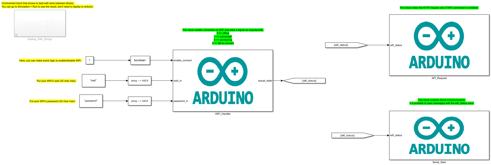

# About

This example use ESP32 to connect to WiFi and then make HTTP Get Requests.
  What is covered:

- ESP32 connection To WiFi (With S-Function);
- HTTP Requests.

# Requeriments

### Software

- MATLAB Version 9.13 (R022b)
- Simulink R2022b 10.6 (R022b)
- MATLAB Support Package for Arduino Hardware (version 22.2.2)
- Simulink Support Package for Arduino Hardware (version 22.2.4)
    Maybe work with newer versions.

### Hardware

- x1 - ESP32 WROOM

# Files:

- <b>main.slx:</b> Model with the main model/logic of the example.

# Blocks

- <b>Dealing_With_Strings: </b> Commented block that shows to deal with texts between blocks.
  You can go to Simulation > Run to see the result, don't need to deplay to arduino.
- <b>WiFi_Handler: </b> This block enable connection to WiFi and pass a signal as output[uint8]:
  - 0 == offline
  - 1 == connected
  - 2 == connecting
  - 3 == fail to connect
- <b>API_Request: </b> This block make the HTTP request only if WiFi connection is enabled.
- <b>Serial_Start: </b> This block enables Serial Communication.
  It is possible to pass messages with the wifi_status input.

# How to use

- Check [How to Use Section](../how_to_use/) and make all initial config.
- Open main.slx.
- Change SSID and Password.
- Hardware > Build, Deploy & Start.
