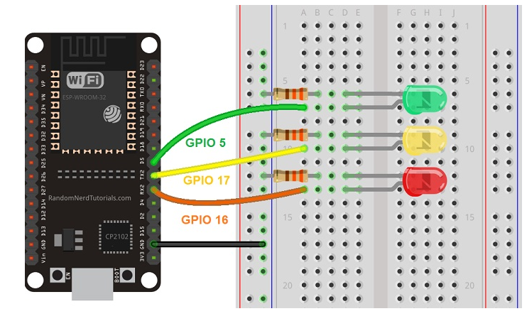
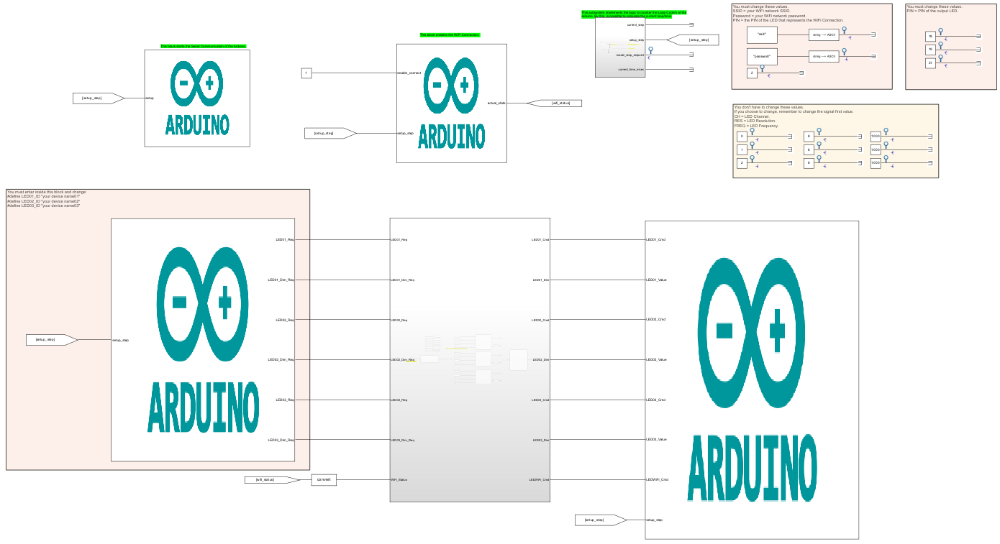

# About

This example ESP32 will be used to connect to WiFi, stabilish a connection with Alexa and turn on/turn off three LEDs connected to ESP32. The standard logic create in LED_Control_Stateflow block make the ESP32 start in 'AllOn mode', which keeps the 3 LEDS changing the brightness for some cycles and after that go to 'Alexa mode', which starts to obbey Alexa commands.
  What is covered:

- Integration between Arduino, Stateflow and Alexa.

# Requeriments

### Software

- MATLAB Version 9.13 (R022b)
- Simulink R2022b 10.6 (R022b)
- MATLAB Support Package for Arduino Hardware (version 22.2.2)
- Simulink Support Package for Arduino Hardware (version 22.2.4)
    Maybe work with newer versions.

### Hardware

- x1 - ESP32
- x1 - Alexa
- x3 - LEDs
- x3 - Resistors (270 Ohm is ok)

### Connections

_Note:  You can change these PINs. In the example I use PINs 18, 19 and 21._

# Files:

- <b>main.slx:</b> Model with the main model/logic of the example.
- <b>lib_fauxmoESP</b> Library to connect to Alexa.
- <b>lib_AsyncTCP</b> Library necessary to use fauxmoESP.
- <b>lib_WiFi</b> Library used to connect to WiFi.
- <b>lib_ESP32Core</b> Library to help in connection with WiFi.

# Blocks

- <b>WiFi_Handler: </b> This block connect to wifi and send true when wifi is connected.
- <b>Serial_Handler: </b> This block start and send signal true when serial communication is ok.
- <b>Steps_Handler: </b> This subsystem implements the logic to counter the Loop Cycle's of the arduino. By this, is possible to calculate the current loop/time.
- <b>Alexa_Handler: </b> This block create the connection with Alexa. You must enter this block to change your device name.
- <b>LED_Control_Stateflow: </b> Contains the logic to turn on/turn off the LEDs.
- <b>LED_Output: </b> Send the command to the ESP32 LEDs.
- <b>Color Areas: </b> Yellow areas: you can change but it is not necessary. Red Area: You must change.

# How to use

- Check [How to Use Section](../how_to_use/) and make all initial config.
- Open main.slx.
- Change ssid and password to connect to WiFi.
- Open alexa block, change your LEDs ID.
- Hardware > Build, Deploy & Start.
