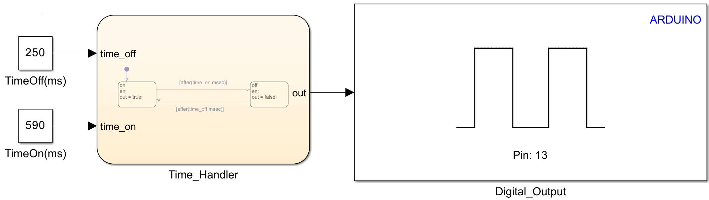

# About

This example use Arduino and build-in LED to blink, by choosing the time on/off on Simulink.
  What is covered:

- Integration between Arduino and Stateflow;
- Use of build-in Arduino Libraries in Simulink.

# Requeriments

### Software

- MATLAB Version 9.13 (R022b)
- Simulink R2022b 10.6 (R022b)
- MATLAB Support Package for Arduino Hardware (version 22.2.2)
- Simulink Support Package for Arduino Hardware (version 22.2.4)
    Maybe work with newer versions.

### Hardware

- x1 - Arduino Uno

# Files:

- <b>main.slx:</b> Model with the main model/logic of the example.

# Blocks

- <b>TimeOff(ms): </b> This changes the time that blink light is off.
- <b>TimeOn(ms): </b> This changes the time that blink light is on.
- <b>Time_Handler: </b> This block is a Simulink's Stateflow.
  It contains the logic to turn on/turn off the output to the Digital IO from Arduino.
- <b>Digital_Output: </b> This is a Build-in (from Arduino Support Package) block. It can recieves boolean (false/true) to turn off/turn on the digital output.

# How to use

- Check [How to Use Section](../how_to_use/) and make all initial config.
- Open main.slx.
- Hardware > Build, Deploy & Start.
