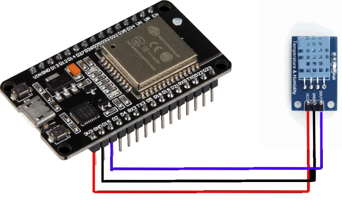
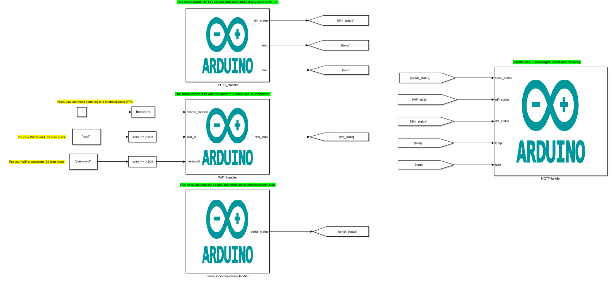

# About

This example ESP32 will be used to connect to WiFi, read data from DHT11 and send the data to MQTT Broker.
  What is covered:

- Integration between Arduino and Stateflow;
- Use of build-in Arduino Libraries in Simulink.

# Requeriments

### Software

- MATLAB Version 9.13 (R022b)
- Simulink R2022b 10.6 (R022b)
- MATLAB Support Package for Arduino Hardware (version 22.2.2)
- Simulink Support Package for Arduino Hardware (version 22.2.4)
    Maybe work with newer versions.

### Hardware

- x1 - ESP32
- x1 - DHT11

### Connections

# Files:

- <b>main.slx:</b> Model with the main model/logic of the example.

# Blocks

- <b>DHT11_Handler: </b> This block reads DHT11 sensor and send false if any error is found.
- <b>WiFi_Handler: </b> This block connect to wifi and send true when wifi is connected.
- <b>Serial_CommunicationHandler: </b> This block start and send signal true when serial communication is ok.
- <b>MQTTHandler: </b> Handle MQTT messages (send and recieve).

# How to use

- Check [How to Use Section](../how_to_use/) and make all initial config.
- Open main.slx.
- Change ssid and password to connect to WiFi.
- Check MQTTHandler block to config your MQTT.
- Hardware > Build, Deploy & Start.
