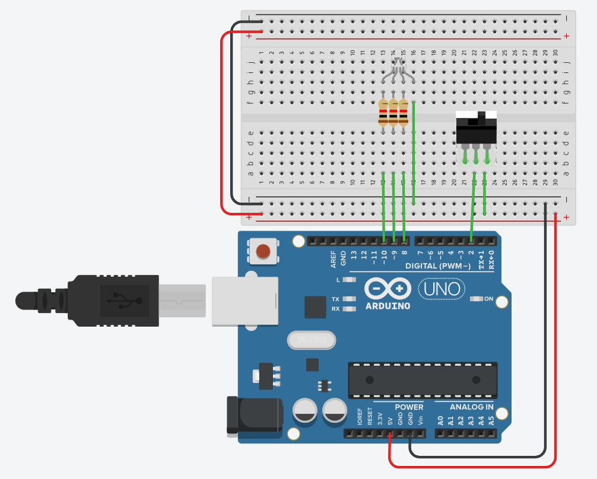
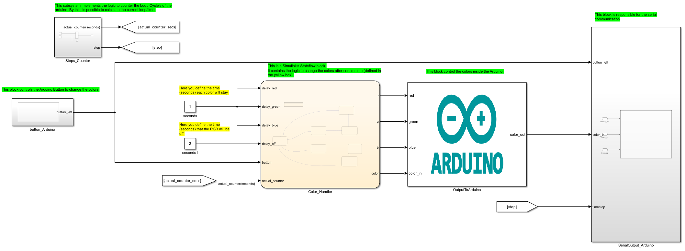

# About

This example use Simulink's Stateflow to manage a RGB LED. Also, use a 2-position button to change the color palette.
  What is covered:

- Integration between Arduino and Stateflow.
- Creation of custom S-Function in Simulink.
- Message Sends on Serial Port.

# Requeriments

### Software

- MATLAB Version 9.13 (R022b)
- Simulink R2022b 10.6 (R022b)
- MATLAB Support Package for Arduino Hardware (version 22.2.2)
- Simulink Support Package for Arduino Hardware (version 22.2.4)
    Maybe work with newer versions.

### Hardware

- x1 - Two Possition Button
- x1 - Arduino Uno
- x1 - RGB LED
- x3 - 270 OHM Resistor

### Connections

# Files

- <b>main.slx:</b> Model with the main model/logic of the example.
- <b>lib_button.slx: </b> Library with the S-Function Builder with Arduino's logic to recieve the button position.
- <b>lib_rgb.slx: </b> Library with the S-Function Builder with Arduino's logic to write the color of the LED.
- <b>lib_serial.slx:</b> Library with the S-Function Builder with Arduino's logic to print messages on Serial Port.

# Blocks

- <b>Button_Arduino: </b> This block controls the Arduino Button to change the colors.
- <b>Steps_Counter: </b> This subsystem implements the logic to counter the Loop Cycle's of the arduino. By this, is possible to calculate the current loop/time.
- <b>Color_Handler: </b> This is a Simulink's Stateflow block.
  It contains the logic to change the colors after certain time (defined in the yellow box).
- <b>OutputToArduino: </b> This block control the colors inside the Arduino.
- <b>SerialOutput_Arduino: </b> This block is responsible for the serial communication.

# How to use

- Check [How to Use Section](../how_to_use/) and make all initial config.
- Open main.slx.
- Hardware > Build, Deploy & Start.
