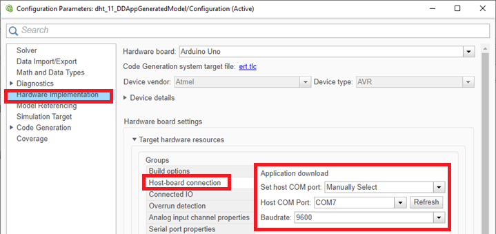
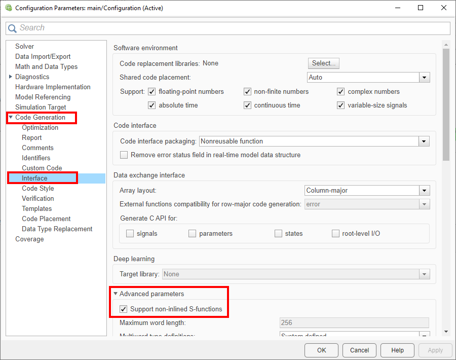

## Software Requirements

- MATLAB Version 9.13 (R2022b) - [MathWorks](https://www.mathworks.com/)
- Simulink R2022b 10.6 (R2022b) - [MathWorks](https://www.mathworks.com/)
- MATLAB Support Package for Arduino Hardware (version 22.2.2) - [MathWorks](https://www.mathworks.com/hardware-support/arduino-matlab.html)
- Simulink Support Package for Arduino Hardware (version 22.2.4) - [MathWorks](https://www.mathworks.com/hardware-support/arduino-simulink.html)

_Note: Compatibility with newer versions is not guaranteed. Verify if Simulink Coder is required for building/compiling._

## Installation of Support Packages

In MATLAB:


## Board Configuration in Simulink

1. Choose your board in the Simulink window:

   

2. Access Hardware Settings:

   

3. Configure your board specifics:

   

   - Change your board as needed.
     <br>_Note: Changing the board may reset some settings to default._

   

Select your COM port to upload to arduino.

4. Set the Solver Configuration:

   

   - Use fixed-step type.
   - Choose a discrete solver.
   - Set the fixed-step size carefully, as it is crucial for hardware performance.

   _Note: <br>With by 5$ chinese Arduino Uno, I choose 1ms (0.001) and got a lot of problems because the Hardware can't handle this speed._

   _I don't know the root cause, but:_

   - _Fixed step size 0.001 (1ms) -> my Arduino Uno could make only 345 cycles in 1 second (should be 1000) -> 34.5%._
   - _Fixed step size 0.003 (3ms) -> my Arduino Uno could make only 333 cycles in 1 second (should be 333) -> 100%, but I noticed some unstable situations._

   - _Fixed step size 0.005 (5ms) -> my Arduino Uno could make only 200 cycles in 1 second (should be 200) -> 100%, working good._
     _<br>There is an example on RGB example about the calculation of cycles/second to check this._

5. Config the Code Generation:


Change the Build Configuration to 'Faster Runs' instead of 'Faster Build' to avoid errors.


If you are going to use SimStruct Functions, you must enable this.

_Note: SimStruct has a lot of functions, specially in IO. For example, if you need to use a input in 'setup loop' of the Arduino, you must use SimStruct. You Can find SimStruct list [here](https://www.mathworks.com/help/simulink/sfg/simstruct_introduction.html)._

6. To deploy code:


## Tips

- The option Monitor & Tune appers to be perfect, since you can see on Simulink's screen what is happening in Arduino, but it is so unstable. Got a lot of erros, delays, bugs.
  <br> I dont recommend to use it.
  <br> If you have a good performance with this, please let me know.

  

- Simulate to test logic within Simulink:

  

- Explore built-in blocks for Arduino in the Simulink Library Browser:

  

## S-Function Builder

1. Set the language to C++ and ensure at least one input/output:

   

2. Code editing window structure:

   

   - Include necessary headers and set up your initialization and loop code within the defined sections.

_There are 5 importants things:_
<br> a. Includes_BEGIN -> Here you put all you includes.
<br> b. Start_BEGIN -> is same of void setup() of Arduino.
<br> c. Output_BEGIN -> is the same of void lopp() of Arduino.
<br> d. All code that must be executed INSIDE OF THE ARDUINO SCOPE must be inside of:

```C++
#ifndef MATLAB_MEX_FILE
//your Arduino code here
#endif
```

<br> e. In the Includes_BEGIN, use:

```C++
 #include <Arduino.h>
```

3. Configure Ports and Parameters:

   

   - Define inputs/outputs for use within the Simulink logic.
     <br>
     _Note: Leave at least 1 input/output or you will get an error like: *"expected primary-expression before 'void’"*_

4. Add custom library paths:

   

   - This allows the addition of custom libraries (e.g., AWS, LiquidCrystal, GPS). There is a lot of tricks to use this feature. Some of they, are:
     - Pay attention to relative paths(since the compile will be relative to the wrapper created)... You may use inside the folder of your projecte: **INC_PATH** with value **../folder/subfolder**. Sometimes is better to include direct the folder, not relative path.
     - You need include both **"lib.h"** and **"lib.cpp"** files.
     - Most of time, you need to add some Core Files (e.g: SPI, WiFi) in the #include:
       - Pay attention with diference between Core libraries from Arduino and ESP32.
       - You can have multiple Arduino IDE installed, but Matlab/Simulink uses it own installation.. <br>(In matlab, use the command **arduinoio.IDERoot** to reach the files that Simulink uses).
       - To find ESP32 Core files, access:
         - Path got from **arduinoio.IDERoot**\portable\packages\esp32\hardware\esp32\1.0.6\libraries or cores.
       - To find Arduino Core files, access:
         - Path got from **arduinoio.IDERoot**\hardware\arduino\avr\libraries or cores.

5. Check the log for success:

   

   - Be aware that successful build messages can still occur despite code errors within the S-Function builder.
